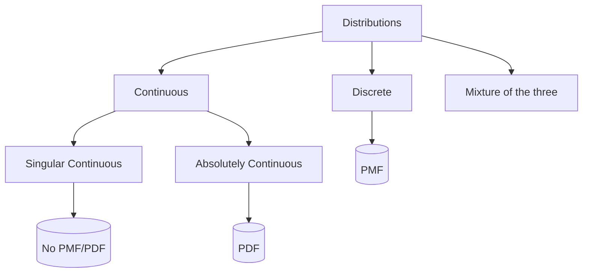

# Surface-level

A distribution tell us how the possible values of a random variable are spread out and how likely each value (or range of values) is to occur. Once we know the distribution of a random variable, we know everything there is to know about its probabilistic behaviour. For instance, if we roll a fair die, the distribution tells us that each outcome (i.e., $1,2,3,4,5,6$) has the same chance of occurring. 

There's also an important split in _how_ a random variable's values behave:
- **Discrete**: values you could list one by one (e.g., rolling a die)
- **Continuous**: values along a continuum with no "next" value (e.g., height, weight, time)

This distinction will matter in the next section where we introduce the tools used to describe distributions.

# Standard-level

The term (probability) *distribution* can mean a few different things in practice: 
- distribution (general)
- cumulative distribution function (CDF)
- probability density function (PDF)
- probability mass function (PMF). 
In applied stats courses, the general definition of a distribution is typically skipped because the CDF completely determines the distribution of a random variable (as we'll cover later on), so we'll start with the CDF. The general definition is reserved for the measure-theoretic section.

>[!definition] **Definition**: Cumulative Distribution Function (CDF)
>If $X$ is a random variable, then its ***cumulative distribution function*** is a function $F_X: \mathbb R \longrightarrow [0,1]$ defined by 
>$$
>F_X(x) := \mathbb P(X \le x) \text{ for all } x
>$$
>>[!notation]-
>> - Also called ***distribution function*** or abbreviated as ***CDF***
>> - The $X$ subscript in $F_X$ may be omitted if it's clear which random variable it refers to

>[!proposition] **Proposition**: Properties of the CDF
>Let $X$ be a random variable with CDF $F_X$. Then $F_X$ is:
>1. **Non-decreasing**: if $x_1 \le x_2$, then $F_X(x_1) \le F_X(x_2)$
>2. **Right-continuous**: $F_X(x_n) \to F_X(x)$ where $x_n \downarrow x$
>3. **Normed**: $\lim\limits_{x \to -\infty} F_X(x) = 0$ and $\lim\limits_{x \to \infty} F_X(x) = 1$
>>[!proof]-
>>1. If $x_1 \le x_2$, then $\{X \le x_1\} \subseteq \{X \le x_2\}$, so by monotonicity of $\mathbb P$,
>>$$
>>F_X(x_1) = \mathbb P(X \le x_1) \le \mathbb P(X \le x_2) = F_X(x_2) \qquad \blacksquare
>>$$
>>2. Let $(x_n)_{n=1}^\infty$ be any sequence with $x_n \downarrow x$, which implies $\{X \le x_n\} \downarrow \{X\le x\}$, and by the continuity of $\mathbb P$,
>>$$
>>F_X(x_n) = \mathbb P(X \le x_n) \longrightarrow \mathbb P(X \le x) = F_X(x) \qquad \blacksquare
>>$$
>>3. Applying same line-of-thinking (continuity of $\mathbb P$) with $x_n \downarrow -\infty$:
>>$$
>>F_X(x_n) = \mathbb P(X \le x_n) \longrightarrow \mathbb P(X \le -\infty) = \mathbb P(\emptyset) = 0
>>$$
>>and $x_n \uparrow \infty$
>>$$
>>F_X(x_n) = \mathbb P(X \le x_n) \longrightarrow \mathbb P(X \le \infty) = \mathbb P(\Omega) = 1 \qquad \blacksquare
>>$$

Every random variable has a unique CDF, which completely determines its distribution (we'll cover this in the measure-theoretic section), and thus contains all the probabilistic information about the random variable. The CDF looks different depending on whether the random variable is *discrete* or *continuous*. Let's clarify what that means in this context, starting with discrete.

## Discrete

>[!definition] **Definition**: Discrete (random variable)
>A random variable $X$ is ***discrete*** if there exists a [[Set theory#^countable|countable]] set of distinct values $S = \{x_1,x_2,\dots\} \subseteq \mathbb R$ such that
>$$
>\sum_{x \in S} \mathbb P(X=x) = 1
>$$

In simpler words, if you can list every possible value a random variable can take, then it's discrete. The list of possible values might be short or go on forever, but you could theoretically write them all down one at a time.

Examples: 
- Coin flip: $\{0,1\}$ can take on 2 values (finite)
- Number of job applications until I get a job: $\{1,2,3, \dots\}$ increasingly unlikely, theoretically infinite, but I can list every rejection I've had (countably infinite)

Common discrete distributions:
- Degenerate
- Discrete Uniform
- Bernoulli
- Binomial
- Geometric
- Negative-binomial
- Poisson
- Hypergeometric

>[!definition] **Definition**: Probability Mass Function (PMF)
>If $X$ is a discrete random variable, its ***probability mass function*** is defined by
>$$
> p_X(x) := \mathbb P(X = x)
>$$

In words, the PMF tells you how much probability sits on each individual value. Naturally, the CDF is built by adding up the PDF at every possible value up to $x$.

>[!theorem] **Theorem**: CDF (discrete)
>If $X$ is a discrete random variable with PMF $p_X$, then 
>$$
>F_X(x) = \sum_{i:x_i \le x} p_X(x_i)
>$$
>>[!proof]-
>>$$
>>F_X(x) \overset{def}{=} \mathbb P(X \le x) \overset{\sigma-add}{=} \sum_{i:x_i \le x} \mathbb P(X=x_i) \overset{def}{=} \sum_{i:x_i \le x} p_X(x_i) \qquad \blacksquare
>>$$

```runnable
::python::
import numpy as np
import matplotlib.pyplot as plt
from scipy.stats import randint

rv = randint(1, 7)
values = np.arange(1, 7)
cdf = rv.cdf(values)

x = np.linspace(0, 7, 1000)
y = rv.cdf(np.floor(x))

plt.scatter(values, cdf)
plt.step(x, y, where="post")

ylabels = [r"$0$"] + [rf"$\frac{{{i}}}{{6}}$" for i in range(1, 6)] + [r"$1$"]
plt.xticks(values); plt.yticks(np.append(0, cdf), ylabels)
plt.xlabel(r"$x$"); plt.ylabel(r"$F_X(x) = \mathbb{P}(X \leq x)$")
plt.title("CDF of a Fair Die Roll")
plt.xlim(0, 7)
plt.grid(alpha=0.3)
plt.show()

::r::
library(ggplot2)

values <- 1:6
cdf <- cumsum(rep(1/6, 6))
df <- data.frame(x = c(0, values, 7), y = c(0, cdf, 1))

ggplot(df, aes(x, y)) +
  geom_step(direction = "hv") +
  geom_point(data = data.frame(x = values, y = cdf), size = 2) +
  scale_x_continuous(breaks = values, limits = c(0, 7)) +
  scale_y_continuous(breaks = c(0, cdf),
                      labels = c("0", "1/6", "2/6", "3/6", "4/6", "5/6", "1")) +
  labs(x = expression(x), y = expression(F[X](x) == P(X <= x)),
       title = "CDF of a Fair Die Roll") +
  theme_minimal()
```

Discrete CDFs end up looking like staircases: flat, and then a sudden jump at each possible value $x_i$, then flat again.

## Continuous

>[!definition] **Definition**: Continuous (random variable)
>A random variable $X$ is ***continuous*** if
>$$
>\mathbb P(X =x) = 0 \text{ for all } x \in \mathbb R
>$$

In words, every individual value $X$ could take has a $0$ probability of occurring ($0$ probability mass). And as a consequence:

>[!corollary] **Corollary**: Continuous random variables take an [[Set theory#^uncountable|uncountable]] number of values
>If $X$ is a continuous random variable with $\mathbb P(X=x)=0$ for all $x\in\mathbb R$, then $X$ takes an [[Set theory#^uncountable|uncountable]] number of values.
>>[!proof]-
>>
>>We'll prove this result by contradiction. Let's assume a continuous random variable $X$ takes a *countable* number of values $S=\{x_1,x_2,\dots\}$. Then,
>>$$
>>\sum_{x \in S} \mathbb P(X = x) = 1
>>$$
>>which is impossible since $\mathbb P(X = x)= 0$ for every $x \in \mathbb R$. Thus, by contradiction, $X$ must take an uncountable number of values. $\qquad \blacksquare$

Example: 
- Distance: $[0,\infty)$
- Weight: $[0,\infty)$

No matter how you try to list the possible values, you'll miss infinitely many of them in between.

One may argue that these examples aren't actually continuous, since our precision is limited (e.g., my scale only displays up to the tenths digit $\pm 0.1$). In fact, you could argue that nothing is truly continuous in the real world using a similar line of thinking. However, we still consider many random variables to be continuous because, in general, continuous distributions are much easier to work with than discrete distributions. At best, they may be considered an approximation of the truth, which is a common theme in statistics.

At this point, you might be wondering...

***1. How is there $0$ probability mass for every point?***

It seems a bit counterintuitive: if every value is *impossible*, how can we have total probability $1$? Intuitively, when we hear $0$ probability of occurring, we think that means impossible. In the discrete (countable) case, that's true. But this doesn't hold for continuous random variables. The probability for continuous random variables simply isn't built by summing individual probability masses. Instead, probability is assigned directly to intervals (this will make more sense when we see the integral notation).

***2. Why would we want that?***

It's only when we have $0$ probability mass everywhere that we get *smoothness/no jumps* in the CDF (unlike the staircase CDF in the discrete case), allowing us to use integrals.

Since each point has $0$ probability mass, it would not be very useful to assign a PMF to our continuous random variables. Instead, let's introduce a new function.

>[!definition] **Definition**: Probability Density Function (PDF)
>Let $f: \mathbb R \longrightarrow \mathbb R$ be a function. Then, $f$ is a ***probability density function*** if 
>1. Non-negative: $f(x) \ge 0$ for all $x \in \mathbb R$
>2. Normed: $\int_{-\infty}^\infty f(x) \mathrm{d} x = 1$

>[!notation] Notation: Interpreting "Mass" vs "Density"
>A PMF assigns probability mass directly to individual points, whereas a PDF assigns density to points; probability is obtained only after integrating that density over a set.
>
>As an analogy, think of the density of water ($\approx 1g/cm^3$). Density tells us the mass per unit volume. To get the total mass of a portion of water, we must integrate over that portion's volume. We can't really get the mass of a specific point in the water since that point's volume would be $0$.

Notice that, unlike PMFs, **PDFs are not necessarily probabilities**, hence the $f$ notation instead of $\mathbb P$. Also, **PMFs/PDFs are not unique.**

Continuous random variables are further subdivided into absolutely continuous and singular continuous (reserved for measure-theoretic section). Continuous random variable **aren't** guaranteed to have a PDF, while absolutely continuous random variables are. In applied stats courses, this distinction is not made and continuous is implicitly assumed to be absolutely continuous.

>[!definition] **Definition**: Absolutely continuous (random variable; standard-level)
>A random variable $X$ is ***absolutely continuous*** if $X$ is a continuous random variable with a PDF $f$, such that
>$$
>\mathbb P(X \in A) = \int_A f(x)\mathrm{d}x,
>$$

>[!theorem] **Theorem**: CDF (absolutely continuous)
>If $X$ is an absolutely continuous random variable, then
>$$
>F_X(x) = \int_{-\infty}^x f(x)\mathrm{d}x
>$$
>>[!proof]-
>>$$
>>F_X(x) \overset{def}{=} \mathbb P(X \le x) = \mathbb P(X \in (-\infty, x]) \overset{(*)}{=} \int_{-\infty}^x f(x)\mathrm{d}x,
>>$$
>>where $(*)$ follows from our standard-level definition of absolutely continuous, setting $A=(-\infty, x]$. $\qquad \blacksquare$

Since $\mathbb P(X=x)=0$ for all $x$, including the endpoints doesn't matter, meaning 
$$
\mathbb P(a \le X \le b) = \mathbb P(a \le X < b) = \mathbb P(a < X \le b) = \mathbb P(a < X < b)
$$

>[!notation]
>$\sim$ means *distributed as*
>
>Example:
>- $X \sim F_X$
>- $X \sim p_X$
>- $X \sim \mathrm{Normal}(0,1)$

There are also random variables that are neither continuous nor discrete (known as mixtures; more on that in the measure-theoretic section), but in most applications, the distributions we deal with are either (absolutely) continuous or discrete. Below is a summary of the distributions associated with the different types of random variables.



Here's what you'll miss:

- General Distribution $\mathbb P_X$ that covers every type of random variable
- Why every random variable has a unique CDF that completely determines its distribution, i.e., showing the CDF $F_X$ is in $1-1$ correspondence with the general distribution $\mathbb P_X$ (Carathéodory's extension theorem)
- Where PDFs actually come from (Radon-Nikodym theorem)
- Proper absolutely continuous definition
- How every distribution can be decomposed into discrete, absolutely continuous, and singular continuous parts (Lebsegue decomposition)

# Measure-theoretic

>[!definition] **Definition**: Distribution (measure-theoretic)
>Let $(\Omega, \mathcal{F}, \mathbb{P})$ be a probability space, $(\mathbb R, \mathcal B)$ a measurable space, and $X: (\Omega, \mathcal F) \longrightarrow (\mathbb R, \mathcal B)$ a random variable. Then, the distribution of $X$ is the probability measure $\mathbb P_X : \mathcal B \longrightarrow [0,1]$ on $\mathbb R$ defined by 
>$$
>\mathbb P_X(B) := \mathbb P\left(X^{-1}(B)\right) \overset{(*)}{=} \mathbb P(X \in B) \quad \text{for all } B \in \mathcal B,
>$$
>where $(*)$ follows from $X^{-1}(B) := \{\omega \in \Omega :  X(\omega) \in B\} =: X \in B$.
>>[!notation]-
>>
>>$\mathbb P_X$ may also be called
>>-  the *law* of $X$; or
>>- the *pushforward measure of $\mathbb P$ induced by $X$ onto $(\mathbb R, \mathcal B)$;*
>>
>>and may also be written as $\mathbb P \circ X^{-1}$.

The first line is just the formal setup for defining a [[Random Variable#^random-variable-measure-theoretic|random variable]]. The second line is defining a new [[Measure Theory#^probability-measure-space|probability measure]] $\mathbb P_X$ in terms of our standard probability measure $\mathbb P$ from our probability space $(\Omega, \mathcal F, \mathbb P)$, with 2 equivalent formulations.

Let's verify that $\mathbb P_X$ as defined is a valid probability measure.

>[!proposition] **Proposition**: $\mathbb P_X$ is a probability measure
>Let $(\Omega, \mathcal{F}, \mathbb{P})$ be a probability space, $(\mathbb R, \mathcal B)$ a measurable space, and $X: (\Omega, \mathcal F) \longrightarrow (\mathbb R, \mathcal B)$ a random variable. Then, $\mathbb P_X$, defined by
>$$
>\mathbb P_X(B) \overset{def}{=} \mathbb P(X^{-1}(B)) = \mathbb P(X \in B) \quad \text{for all } B \in \mathcal B,
>$$
>is a probability measure on $(\mathbb R, \mathcal B)$.
>>[!proof]- Proof
>>- **Non-negativity**:  $\mathbb P_X(B) \overset{def}{=} \mathbb P\left(X^{-1}(B)\right) \ge 0$ for all $B \in \mathcal B$
>>- **Normed**: $\mathbb P_X(\mathbb R) \overset{def}{=} \mathbb P\left(X^{-1}(\mathbb R)\right) = \mathbb P\left(\Omega\right) = 1$
>>- **Countable ($\sigma$) additivity**: Let $(B_n)_{n=1}^\infty \subseteq \mathcal B$ be a sequence of pairwise disjoint sets. It follows that 
>>$$
>>\begin{align*}
>> \mathbb P_X\left(\bigcup_{n=1}^\infty B_n\right) 
>> &\overset{def}{=} \mathbb P\left(X^{-1}\left(\bigcup_{n=1}^\infty B_n\right)\right) \\ &= \mathbb P\left(\bigcup_{n=1}^\infty X^{-1}\left( B_n\right)\right) && \text{Preimages preserve unions and disjointness}\\
>> &= \sum \limits_{n=1}^\infty \mathbb P\left(X^{-1}\left( B_n\right)\right) && \text{from $\sigma$-additivity of $\mathbb P$}\\
>> &\overset{def}{=} \sum \limits_{n=1}^\infty \mathbb P_X\left( B_n\right)
>> \qquad \blacksquare
>> \end{align*}
>> $$

## Connection to CDF

The CDF from the standard-level section is just by definition this measure $\mathbb P_X$ evaluated on $(-\infty, x]$:
$$
F_X(x) \overset{def}{=} \mathbb P(X\le x) \overset{def}{=} \mathbb P_X((-\infty,x])
$$
for all $x\in \mathbb R$. Also in the standard-level section, we derived 3 properties from the CDF definition, but it actually goes both ways: any function with those properties *is* a CDF of any random variable $X$ with distribution $\mathbb P_X$.

>[!theorem] **Theorem**: Existence and Uniqueness of $\mathbb P_X$ from $F$
>Let $F: \mathbb R \to [0,1]$ be non-decreasing, right-continuous, with $\lim_{x\to-\infty} F(x) = 0$ and $\lim_{x\to\infty}F(x)=1$. Then, there exists a ***unique*** probability measure $\mathbb P_X$ on $(\mathbb R, \mathcal B)$ such that
>$$
>\mathbb P_X((a, b]) = F(b)-F(a) \quad \text{for all } a,b \in \mathbb R
>$$
>with 
>$$
>\mathbb P_X((-\infty, x]) = F(x) \quad \text{for all } x \in \mathbb R
>$$
>>[!proof]-
>>
>>The general idea of this proof is to define a [[Measure Theory#^premeasure|premeasure]] (on an [[Measure Theory#^algebra|algebra]]) in terms of $F$ and extend it to our probability measure $\mathbb P_X$ (on a $\sigma$-algebra) using [[Measure Theory#^caratheodory-extension|Carathéodory's extension theorem]]. We're trying to get 
>>$$
>>\mathbb P_X((a,b]) = F(b) - F(a) \text { for all } a\le b
>>$$
>>with the special case
>>$$
>>\mathbb P_X((-\infty,x]) = F(x) \text { for all } x \in \mathbb R
>>$$
>>so let's define our premeasure as 
>>$$
>>\mu_0((a,b]) := F(b) - F(a) \text { for all } a\le b
>>$$
>>and let $\mathcal A$ be the algebra generated by finite disjoint unions of half-open intervals $(a,b]$. $\mu_0$ is well-defined (i.e., same input gives same output) by the telescoping argument. Let's verify that $\mu_0$ is a premeasure on $\mathcal A$. 
>>- $\mu_0(\emptyset) = \mu_0((a,a]) \overset{def}{=} F(a)-F(a) = 0$
>>- **Non-negative**: $\mu_0((a,b]) \overset{def}{=} F(b)-F(a) \ge 0$ from non-decreasing property of $F$
>>- **Countable additivity**: 
>>
>>Let $(A_n)_{n=1}^\infty \subseteq \mathcal A$ be a sequence of pairwise disjoint sets, $A := \bigcup_{n=1}^\infty A_n \in \mathcal A$, and $S_n := \bigcup_{k=1}^n A_k$ be the partial unions. We're trying to show 
>>$$
>>\mu_0(A) = \sum_{n=1}^\infty \mu_0(A_n)
>>$$
>>which is equivalent to showing both $\mu_0(A) \le \sum_{n=1}^\infty \mu_0(A_n)$ and $\mu_0(A) \ge \sum_{n=1}^\infty \mu_0(A_n)$
>>
>>($\ge$) case: Since $S_n \subseteq A$, $\mu_0(A) \ge \mu_0(S_n) \overset{f-add}{=} \sum_{n=1}^N \mu_0(A_n)$ for all $n \in \mathbb N$, then take the limit as $N \to \infty$. 
>>
>>($\le$) case:
>>From right continuity of $F$, we may choose
>>- $a+\delta>a$ such that $F(a + \delta)-F(a)<\frac{\epsilon}{2}$; and
>>- $b_n + \epsilon_n>b_n$ such that $F(b_n+\epsilon_n) - F(b_n) < \frac{\epsilon}{2^{n+1}}$
>>
>>Then, we have a compact set $[a+\delta, b] \subseteq (a,b] \subseteq \bigcup_{n=1}^\infty (a_n, b_n+\epsilon_n) =: \bigcup_{n=1}^\infty O_n$ with an open cover, thus applying the [[content/Math Appendix/Real Analysis#^heine-borel|Heine-Borel Theorem]], there exists a finite subcover $\bigcup_{i=1}^N O_{n_i}$ such that $[a+\delta, b]\subseteq \bigcup_{i=1}^N O_{n_i}$.
>>
>>Using this, we can find an upper bound on $\mu_0((a+\delta, b])$:
>>$$
>>\begin{align*}
>>\mu_0((a+\delta, b]) &\le \mu_0\left(\bigcup_{i=1}^N(a_{n_i}, b_{n_i}+\epsilon_{n_i}]\right) && \text{since } (a+\delta, b] \subseteq [a+\delta, b] \subseteq \bigcup_{i=1}^N(a_{n_i}, b_{n_i}+\epsilon_{n_i}) \subseteq \bigcup_{i=1}^N(a_{n_i}, b_{n_i}+\epsilon_{n_i}] \\
>>&\le \sum_{i=1}^N \mu_0((a_{n_i}, b_{n_i} + \epsilon_{n_i}]) && \text{from finite sub-additivity}\\
>>&= \sum_{i=1}^N \underbrace{\mu_0((b_{n_i}, b_{n_i}+\epsilon_{n_i}])}_{< \frac{\epsilon}{2^{n_i+1}}} + \sum_{i=1}^N \mu_0((a_{n_i}, b_{n_i}]) && \text{from right-continuity of $F$}\\
>>&< \frac{\epsilon}{2} \underbrace{\sum_{n=1}^\infty (2^{-n})}_{1} + \sum_{n=1}^\infty \mu_0(A_n)
>>\end{align*}
>>$$
>>Finally, we get our upper bound on $\mu_0(A)$:
>>$$
>>\mu_0(A) = \mu_0((a,a+\delta]) + \mu_0((a+\delta,b]) < \frac{\epsilon}{2} + \sum_{n=1}^\infty \mu_0(A_n) + \frac{\epsilon}{2}
>>$$
>>for all $\epsilon > 0$, which is equivalent to $\mu_0(A) \le \sum_{n=1}^\infty \mu_0(A_n).\qquad \blacksquare$
>>
>>By Carathéodory extension, $\mu_0$ extends to a measure $\mathbb P_X$ on $\sigma(\mathcal A) = \mathcal B$. Normedness of $F$ makes $\mu_0$ $\sigma$-finite so it is also unique. Normedness of $F$ also gives $\mathbb P_X(\mathbb R) = \lim_{n\to\infty}\left(F(n)-F(-n)\right) = 1$, so $\mathbb P_X$ is a probability measure. Finally,
>>$$
>>\mathbb P_X((-\infty,x]) = \lim_{n\to\infty} \mathbb P_X((-n,x]) = \lim_{n\to\infty}\left(F(x) - F(-n)\right) = F(x) \qquad \blacksquare
>>$$

To add to appendix:
- Well-defined
- Telescoping sum argument
- Continuity from below

This shows that the CDF $F$ and the probability measure $\mathbb P_X$ are in $1-1$ correspondence, which is why we can work with $F$ instead of $\mathbb P_X$ directly. Before we move on to PMFs/PDFs, we have to revise some definitions.

## Connection to PMF/PDF

The standard-level discrete definition is correct, however, it can be reframed in terms of $\mathbb P_X$.

> [!definition] **Definition**: Discrete (random variable; measure-theoretic)
> Let $(\Omega, \mathcal{F}, \mathbb{P})$ be a probability space, $(\mathbb R, \mathcal B)$ a measurable space, and $X: (\Omega, \mathcal F) \longrightarrow (\mathbb R, \mathcal B)$ a random variable with distribution $\mathbb P_X$. Then, $X$ is ***discrete*** if there exists a countable set $S \subseteq \mathbb R$ and a PMF $p_X: \mathbb R \rightarrow [0,1]$ such that
> $$
> \mathbb P_X(B) = \mathbb P_X \left( \bigcup_{x \in B\cap S} \{x\}\right) \overset{\sigma-add}{=} \sum_{x \in B\cap S} \mathbb P_X(\{x\}) = \sum_{x \in B \cap S} p_X(x) \quad \text{for all } B \in \mathcal B
> $$

In the standard-level section, we said a random variable $X$ is absolutely continuous if it's continuous and has a PDF. This isn't entirely wrong, but it's a bit backwards; our random variable has a PDF *because* it is absolutely continuous.

> [!definition] **Definition**: Absolutely continuous (random variable; measure-theoretic)  
> Let $(\Omega, \mathcal{F}, \mathbb{P})$ be a probability space, $(\mathbb R, \mathcal B)$ a measurable space, and $X: (\Omega, \mathcal F) \longrightarrow (\mathbb R, \mathcal B)$ a random variable with distribution $\mathbb P_X$. Then, $X$ is ***absolutely continuous*** if its distribution $\mathbb P_X$ is [[Measure Theory#^absolutely-continuous-measures|absolutely continuous]] with respect to the Lebesgue measure $\lambda$, written as 
> $$
> \mathbb P_X \ll \lambda
> $$ 

In the discrete (countable) case, notice that we already have the connection between $\mathbb P_X$ and the PMF $p_X$ just from $\sigma$-additivity (since we're dealing with countable, disjoint sets). However, in the absolutely continuous (uncountable) case, we don't have that same luxury. To connect $\mathbb P_X$ to the PDF $f_X$, we have to use the Radon-Nikodym theorem.

>[!corollary] **Corollary**: Existence of PDF
>If $X$ is an absolutely continuous random variable, i.e., $\mathbb P_X \ll \lambda$, then the PDF of $X$ is 
>$$
>f_X = \dfrac{d\mathbb P_X}{d\lambda},
>$$
>where $f_X$ is known as the ***Radon-Nikodym derivative***.
>>[!proof]-
>>
>>Since $\mathbb P_X \ll \lambda$, the [[Measure Theory#^radon-nikodym|Radon-Nikodym Theorem]] guarantees the existence of $f_X := \frac{d\mathbb P_X}{d\lambda}$ for all $B \in \mathcal B$. $\qquad \blacksquare$

Only absolutely continuous random variables have PDFs because that is the condition needed to invoke the Radon-Nikodym theorem.

### Lebesgue Integral notation

Both the PMF-sum and the PDF-integral can be written as a single expression once we treat $\mathbb P_X$ itself as something to integrate against.

>[!definition] **Definition**: $\mathbb P_X$​ in Lebesgue integral notation  
>$$  
>\mathbb P_X(B) := \int_B d\mathbb P_X \quad \text{for all } B \in \mathcal B
>$$

This identity actually holds for any measure, not just $\mathbb P_X$. It's just included here to set up the following proposition, which will tie back to the Riemann integral form that we're used to from the standard-level section.

>[!proposition] **Proposition**: Recovering the standard-level PDF (Riemann-integral form)
>If $X$ is absolutely continuous (wrt Lebesgue measure), i.e., $\mathbb P_X \ll \lambda$, then 
>$$
>\mathbb P_X(B) = \int_B f_X(x)\,dx \quad \text{for all } B \in \mathcal B
>$$
>>[!proof]-
>>$$
>>\mathbb P_X(B) \overset{def}{=} \int_B d\mathbb P_X \overset{(*)}{=} \int_B f_X\,d\lambda \overset{(!)}{=} \int_B f_X(x)\,dx \quad \text{for all } B \in \mathcal B,
>>$$
>>where $(*)$ follows from the Radon-Nikodym derivative $f_X = \frac{d\mathbb P_X}{d\lambda}$, and $(!)$ holds as long as the integrand is Riemann-integrable. $\qquad \blacksquare$

## Special cases

We mentioned earlier that a random variable that's continuous, but not absolutely continuous is called singular continuous.

>[!definition] **Definition**: Singular continuous (random variable)
> Let $(\Omega, \mathcal{F}, \mathbb{P})$ be a probability space, $(\mathbb R, \mathcal B)$ a measurable space, and $X: (\Omega, \mathcal F) \longrightarrow (\mathbb R, \mathcal B)$ a random variable with distribution $\mathbb P_X$. Then, $X$ is ***singular continuous*** if it satisfies
> 1. $\mathbb P_X(x)=0$ for all $x \in \mathbb R$
> 2. [[Measure Theory#^singular-measures|Singularity]]: $\mathbb P_X \perp \lambda$

The first condition is the continuous condition from the standard-level section (no probability mass), and the singularity condition indicates $\mathbb P_X$ is *not* absolutely continuous (i.e., singularity is the opposite of absolutely continuous).

Finally with the help of the Lebesgue Decomposition theorem, we see that every distribution is comprised of a mixture of the three cases (discrete, absolutely continuous, singular continuous).

>[!corollary] **Proposition**: Three-way decomposition of $\mathbb P_X$
>Every $\mathbb P_X$ decomposes uniquely as
>$$
>\mathbb P_X = \underbrace{\mathbb P_X^{disc}}_{\text{PMF}} + \underbrace{\mathbb P_X^{ac}}_{\text{PDF}} + \underbrace{\mathbb P_X^{sc}}_{\text{no PMF or PDF}}
>$$
>>[!proof]-
>>$$
>>\mathbb P_X \overset{(*)}{=} \mathbb P_X^{ac} + \mathbb P_X^{sing} \overset{(!)}{=} \mathbb P_X^{ac} + \mathbb P_X^{disc} + \mathbb P_X^{sc}
>>$$
>>where $(*)$ follows directly from the [[Measure Theory#^lebesgue-decomposition|Lebesgue Decomposition Theorem]], and $(!)$ follows from $\mathbb P_X^{sing}$ comprising of disjoint discrete and continuous parts. To see this, let $S$ be a countable set such that $\mathbb P_X^{sing}(x) >0$ for all $x \in S$. Then, $\mathbb P_X^{sing}(B)$ can be written as
>>$$
>>\mathbb P_X^{sing}(B) = \mathbb P_X^{sing}\left((B\cap S) \cup (B\cap S^c)\right) \overset{f-add}{=} \underbrace{\mathbb P_X^{sing}(B\cap S)}_{discrete} + \underbrace{\mathbb P_X^{sing}(B \cap S^c)}_{singular\ continuous}
>>$$
>>for all $B \in \mathcal B$. 
>>
>>Showing $\mathbb P_X^{disc} (B) := \mathbb P_X^{sing}(B \cap S)$ is discrete:
>>- Since $S$ is countable and $\mathbb P_X^{disc}(B) := \mathbb P_X^{sing}(B \cap S) \overset{\sigma-add}{=} \sum_{x \in B\cap S} \mathbb P_X^{sing}(x)$, $\mathbb P_X^{disc}$ satisfies discrete definition with PMF $p_X(x) := \mathbb P_X^{sing}(x)$
>>
>>Showing $\mathbb P_X^{sc}(B) := \mathbb P_X^{sing}(B \cap S^c)$ is singular continuous:
>>- Continuous: $\mathbb P_X^{sc}(x) = 0$ for all $x \in \mathbb R$
>>$$
>>\mathbb P_X^{sc}(x) := \mathbb P_X^{sing}(x\cap S^c) =
>>\begin{cases}
>>0, & x \in S \text{ since } S\cap S^c = \emptyset \\
>>0, & x \in S^c \text{ by definition of }S
>>\end{cases}
>>$$
>>- Singular: $\mathbb P_X^{sc} \perp \lambda$
>>$$
>>\mathbb P_X^{sc}(B) := \mathbb P_X^{sing}(B \cap S^c) \le \mathbb P_X^{sing} (B) = 0
>>$$
>>for all $B \in \mathcal B$. Together, they satisfy the singular continuous definition. $\qquad \blacksquare$


